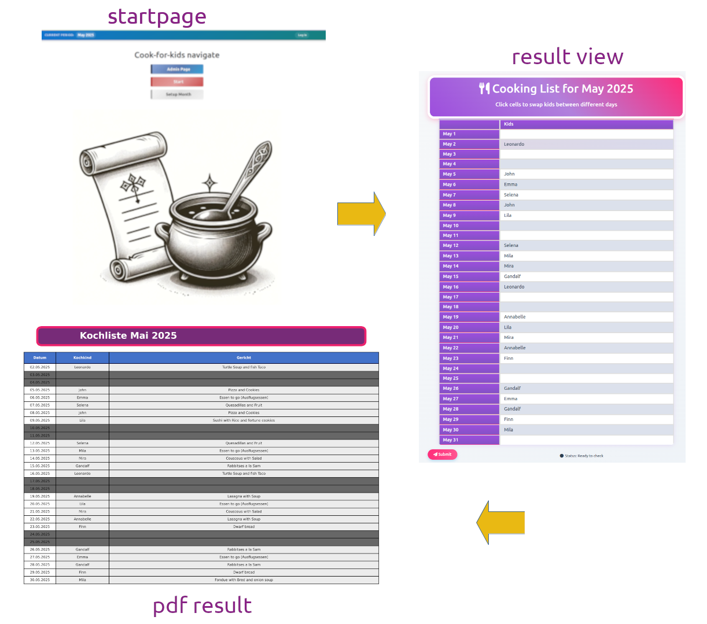

# Cook-for-kids

[](https://github.com/daberer/cook-for-kids/actions/workflows/django-tests.yml)

**Cook-for-kids** is an application developed to help parents of a kindergarten group **rotate monthly meal duties.** This tool **simplifies the organization and scheduling of meal preparation responsibilities** among parents.

### Technical Implementation
The application is built using:

* Python Django framework for the core functionality
* Django forms for data input handling
* JavaScript backend for interactive features
* SQLite database for storing parent information and scheduling data

### Key Features
The application's standout feature is its **scheduling algorithm** which:

* Uses a recursive Sudoku algorithm to assign cooking duties
* Takes into account parent "waiver days" (days when parents are unavailable)
* Optionally optimizes the schedule to maximize the interval between cooking duties for all parents simultaneously

### User Experience
After the schedule is generated, users can:

* **Edit the results** on a dedicated view page
* **Export the finalized schedule directly to PDF** for easy distribution to all parents
This application effectively eliminates the hassle of manual scheduling while ensuring fair distribution of cooking responsibilities among all parents in the kindergarten group.

## Overview



## Setup Instructions

### Prerequisites
- Python 3.12
- Git

### Installation

**Clone the repository**
  ```bash
   git clone https://github.com/daberer/cook-for-kids.git
 ```

**Create a virtual environment, install dependencies and set up database**

Create either a conda environment or a Python virtual environment (venv) with Python 3.12.


```Bash
pip install -r requirements.txt
pip install -e .
python manage.py migrate
```

**Create an admin user**

```Bash
python manage.py createsuperuser
```


Follow the prompts to create your admin account.


**Run the development server**


```Bash
python manage.py runserver
```

The application will be available at http://127.0.0.1:8000/

MIT License
